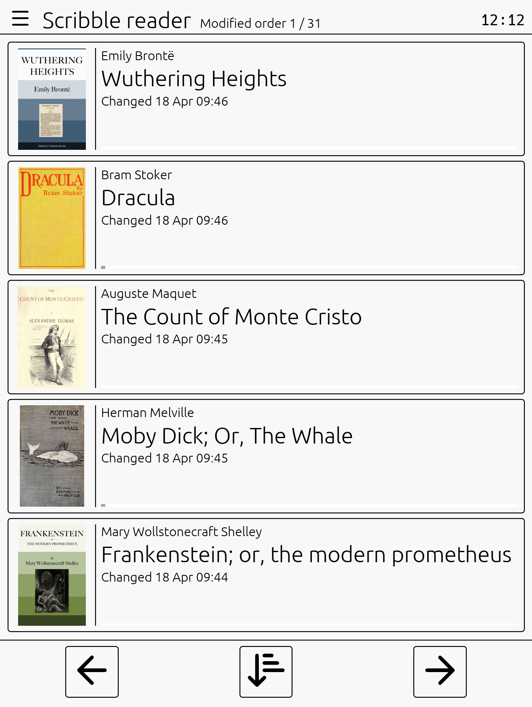
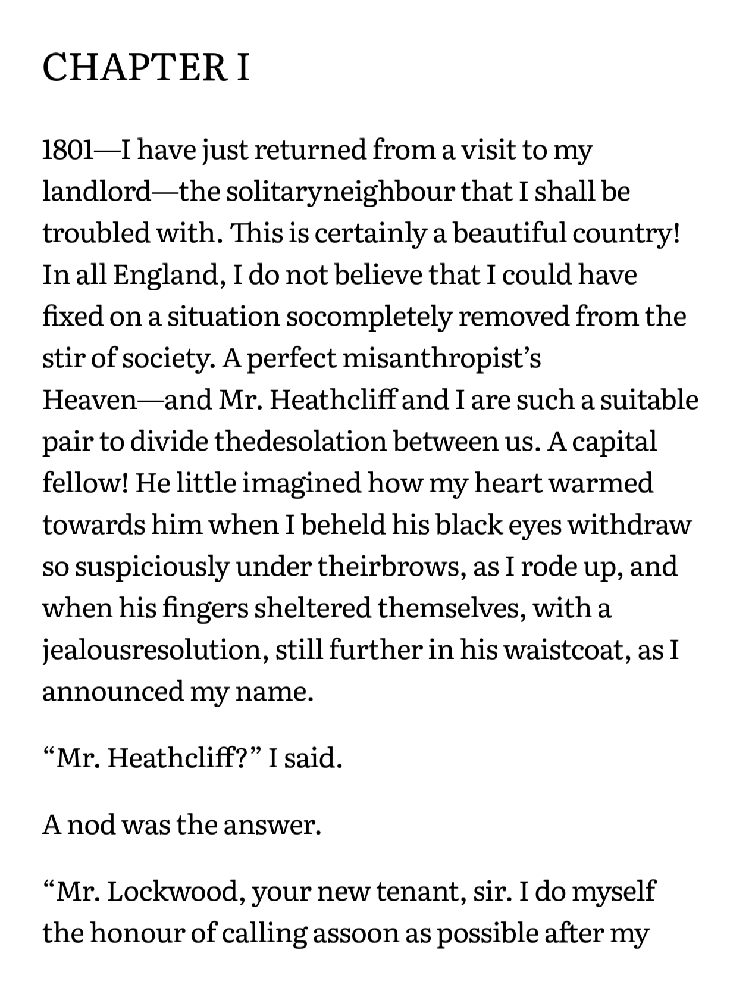
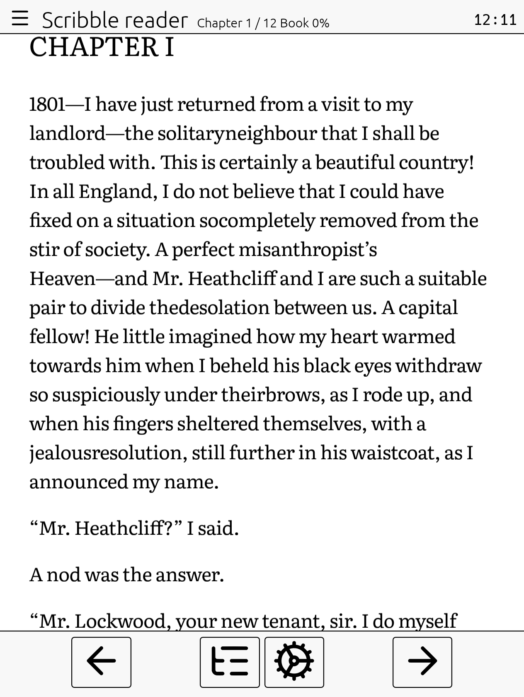
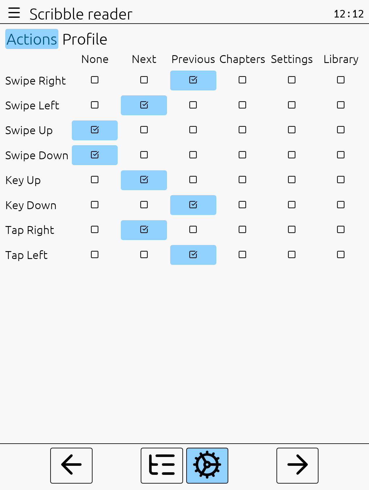
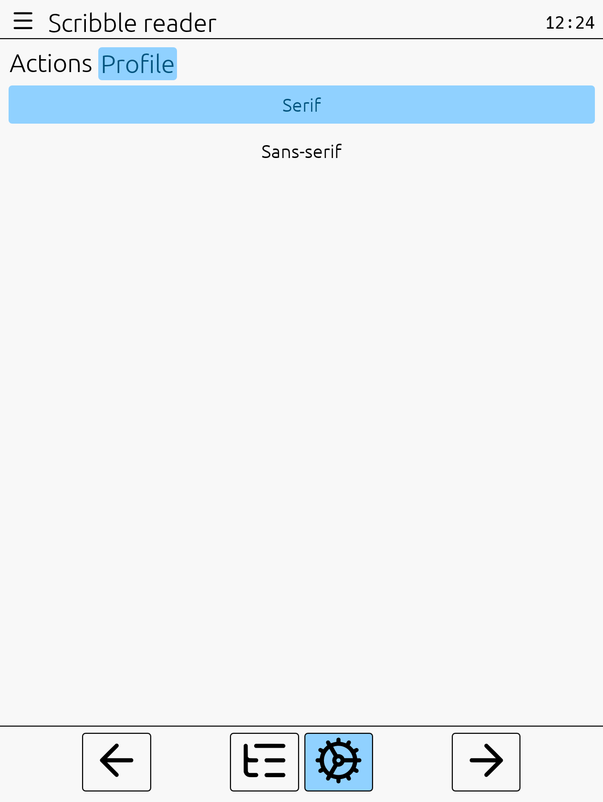

# Scribble Reader

E-ink optimized ebook reader for Android with a focus on efficiency and minimal distractions.

## Why?

Most of my books are large ones that gets appended to weekly, primarily generated with [epub-builder](https://github.com/crowdagger/epub-builder);
This makes location tracking and efficient read patterns important, and also disqualifies most readers available for free.
It is also a sufficiently complicated problem for a hobby project. :D

## Download

Grab the apk from [latest release](https://github.com/ksonny/scribble-reader/releases/latest) and sideload to your device.
Alternatively, use [Obtanium](https://obtainium.imranr.dev/).

## Profiles

You can create your own illustrator render profile.
Currently this has to be done via config file in the app data folder as dev hasn't caught up yet. :D

You can start the basic profile below and edit it according to taste.
On Android, add config file at `/storage/self/primary/Android/data/org.lotrax.scribblereader/files/config/config.toml`.
Config overrides default, so you can modify the base profiles by having the same key.

Restart the app to reload configuration and make your profile selectable under settings.

```toml
[illustrator."Profile A"]
font_size = 16.0
line_height = 1.5
h1 = { font_size_em = 1.8, padding_em = 1.5 }
h2 = { font_size_em = 1.4, padding_em = 1.5 }
h3 = { font_size_em = 1.2, padding_em = 1.5 }
h4 = { font_size_em = 1.0, padding_em = 1.5 }
h5 = { font_size_em = 1.0, padding_em = 1.5 }

[illustrator."Profile A".font_regular]
family = "sans-serif"
variation.wght = 400

[illustrator."Profile A".font_italic]
family = "sans-serif"
variation.wght = 400
variation.ital = 1.0

[illustrator."Profile A".font_bold]
family = "sans-serif"
variation.wght = 600

[illustrator."Profile A".padding]
top_em = 2.0
left_em = 2.0
right_em = 2.0
bottom_em = 2.0
paragraph_em = 1.2
```

Possible font variation axis are these, availability is per font:
```toml
variation.wght = <number>
variation.wdth = <number>
variation.ital = <number>
variation.slnt = <number>
variation.opzs = <number>
```

Embedded fonts and available axis:
* `Open Sans` - `ital`, `wight`, `wdth`
* `Literata` - `ital`, `wght`, `opsz`
* `EB Garamond` - `ital`, `wght`

In additon, `sans-serif` is an alias for `Open Sans`, and `serif` is an alias for `Literata`.

## Crates

* `app-android` - Android activity & glue
* `main` - Main event loop, wgpu rendering and views
* `scribe` - Models, database, Epub parsing and settings
* `illustrator` - Epub layouting
* `sculpter` - Font shaping and printing
* `wrangler` - File system abstraction for Android storage madness

## Develop Android

Requires Android Studio & Java installed to build the Android app!

Create `crates/app-android/keystore.properties` with these properties set according to your local setup:

```properties
storeFile=
storePassword=
keyAlias=
keyPassword=

```

* `cargo install just`
* `just setup`
* `just build`

See also `just install` to upload the resulting apk to your device.

## Screenshots






